<div align="center">

# 📽️ YouTube Clone API

### A Scalable, Production-Grade Backend Infrastructure


<br/>

[**Documentation**](#) • [**Features**](#features) • [**Installation**](#getting-started) • [**Architecture**](#architecture)

</div>

---

## 🌩️ Overview

This project implements a high-performance RESTful API designed to power video streaming platforms. It features advanced user management, complex permission systems, video transcoding triggers, and social interactions like comments, subscriptions, and likes.

Built with a focus on **scalability** and **clean code architecture**, it utilizes industry-standard patterns for authentication, data validation, and error handling.

---

## 🏗️ Architecture

```mermaid
graph TD
    Client[📱 Client / Frontend] -->|REST API| LB[🛡️ Load Balancer / Nginx]
    LB --> Server[🚀 API Server Cluster]
    
    subgraph "Backend Infrastructure"
        Server --> Auth[🔐 Auth Middleware]
        Server --> Controller[🎮 Controllers]
        
        Controller --> Service[💼 Services]
        
        Service --> Model[📦 Data Models]
        Service --> Cloud[☁️ Cloudinary Storage]
        
        Model --> DB[(🗄️ MongoDB Cluster)]
    end
    
    subgraph "Core Features"
        User[👤 User Mgmt]
        Video[📹 Video Processing]
        Social[❤️ Social Graph]
    end
    
    Controller -.-> User
    Controller -.-> Video
    Controller -.-> Social
```

<div align="center">
  


</div>

---

## ✨ Features

| Module                | Description                                                            |
| :-------------------- | :--------------------------------------------------------------------- |
| **🔐 Authentication** | Secure JWT-based auth with Access & Refresh tokens, Brcypt hashing.    |
| **👤 User Profile**   | Avatar/Cover upload, Watch History, Password management.               |
| **📹 Video Core**     | Video upload, publishing toggles, view counting, thumbnail processing. |
| **📺 Subscriptions**  | Channel subscription logic, subscriber counts, feed generation.        |
| **💬 Social**         | Comments, Likes, Tweets, and community interactions.                   |
| **🔔 Notifications**  | Settings for email/app notifications on interactions.                  |
| **🛡️ Security**       | Verified accounts, Admin roles, standardized error handling.           |

---

## 🚀 Getting Started

### Prerequisites

- Node.js (v18+)
- MongoDB Instance

### Installation

```bash
# 1. Clone the repository
git clone https://github.com/yourusername/youtube-clone-api.git

# 2. Install dependencies
npm install

# 3. Configure Environment
cp .env.sample .env
# (Update .env with your MongoDB URI and Secrets)

# 4. Start the server
npm start
```

---

## 📂 Project Structure

```text
src/
├── 📂 config           # Database & App Configuration
├── 📂 controllers      # Request Logic & Responses
├── 📂 middlewares      # Auth, Validation, Error Handling
├── 📂 models           # Mongoose Schemas & Hooks
├── 📂 routes           # API Route Definitions
├── 📂 utils            # Async Wrapper, API Response/Error
└── server.js           # App Entry Point
```

---

## 🛠️ Tech Stack Details

- **Core:** Node.js, Express.js
- **Database:** MongoDB, Mongoose (with Aggregation Pipelines)
- **Storage:** Cloudinary (Images/Videos), Multer
- **Authentication:** JSON Web Tokens (JWT), Bcrypt
- **Utilities:** Dotenv, Cookie-parser, CORS

---

<div align="center">

**Developed with ❤️ by Shivam**

</div>
